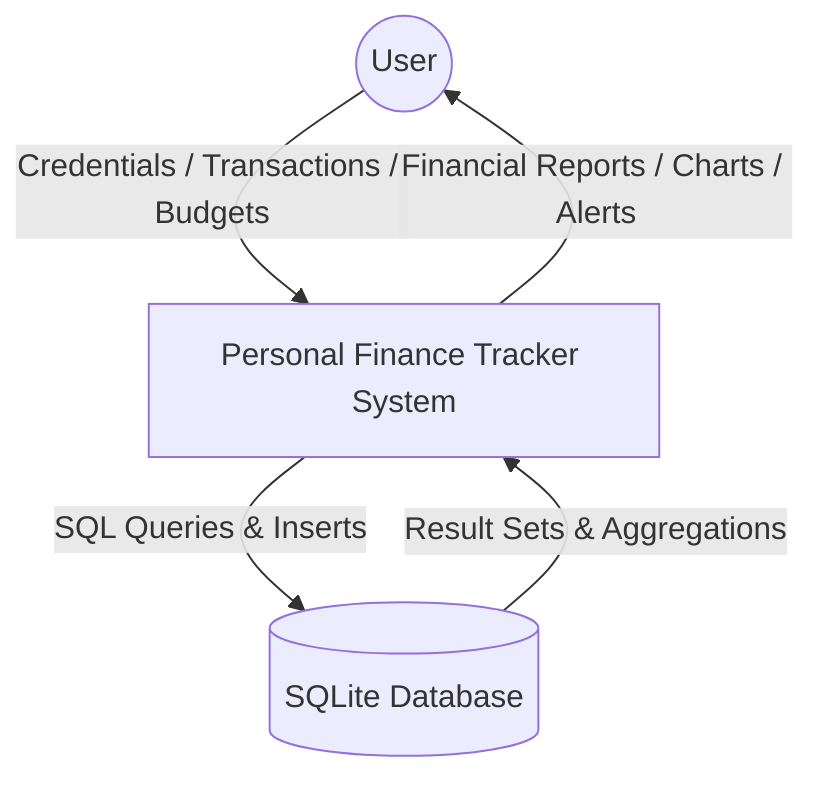
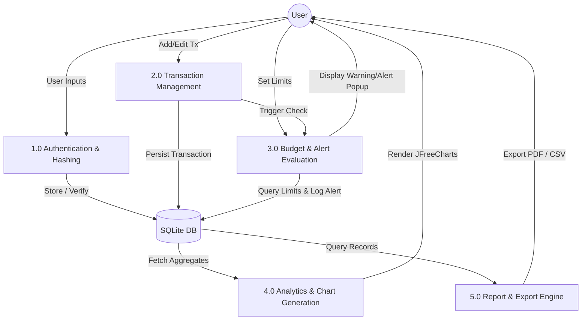

# Micro Project Report: Personal Finance Tracker

**Course / Domain**: Object-Oriented Programming & Software Engineering  
**Industry Focus**: Financial Planning, Personal Budgeting & Wealth Management  
**Application Type**: Desktop Software Application (Java GUI / SQLite)  
**Author**: Project Team  
**Academic Year**: 2026  

---

## 1. Abstract
The **Personal Finance Tracker** is a comprehensive desktop software system engineered in Java to assist individuals in managing cash flow, budgeting, financial discipline, and expenditure monitoring. Utilizing an **MVC (Model-View-Controller) + DAO (Data Access Object)** architecture, the application integrates **Java Swing** with **FlatLaf** for a contemporary, ergonomic user interface, **JDBC with SQLite** for local, zero-configuration database persistence, **JFreeChart** for financial data visualization, and **OpenPDF** for generating structured financial statements. 

The system implements automated real-time spending limit alerts (triggering notifications at 80% and 100% budget utilization), multi-criteria filtering, audit logging, cryptographic user authentication (SHA-256 with per-user salt), and one-click demo data generation.

---

## 2. Objectives & Scope

### 2.1 Objectives
1. **Automated Record Keeping**: Provide seamless recording, updating, and auditing of Income, Expense, and Savings transactions.
2. **Category-Level Budgeting**: Allow users to define monthly expenditure caps per category to prevent overspending.
3. **Real-Time Financial Intelligence**: Evaluate transactions upon insertion/modification and trigger instant visual alerts when thresholds (80% warning, 100% limit reached) are breached.
4. **Visual Analytics**: Render clear graphical breakdowns including category distribution pie charts, monthly spending trend lines, income-vs-expense comparisons, and budget compliance bar charts.
5. **Standardized Reporting**: Enable one-click export of structured reports into CSV and PDF formats for tax, record-keeping, and auditing purposes.

### 2.2 Scope
- Single-user / Multi-account desktop installation with local persistent SQLite storage.
- Auto-initialization of schema and default seed categories on first launch.
- Zero external server or database setup required.

---

## 3. Technology Stack & Architectural Specifications

| Component | Technology | Rationale |
| :--- | :--- | :--- |
| **Programming Language** | Java (JDK 17+) | Platform independence, robust type safety, rich standard libraries |
| **Graphical User Interface** | Java Swing + FlatLaf 3.4.1 | Clean, native look-and-feel with modern design components and dark/light support |
| **Database & Persistence** | SQLite 3 + SQLite-JDBC Driver | Lightweight, zero-setup, ACID-compliant embedded database |
| **Data Visualization** | JFreeChart 1.5.4 | Industry-standard 2D data visualization library for interactive charts |
| **Document Generation** | OpenPDF 1.3.39 | Fast, pure-Java PDF compilation for professional financial reports |
| **Build & Packaging** | Apache Maven + Maven Shade Plugin | Dependency management, automated test execution, and runnable executable FAT JAR packaging |
| **Testing Framework** | JUnit 5 (Jupiter) | Automated unit testing of data access objects and business alert rules |

---

## 4. System Architecture & Design Patterns

The system adheres strictly to the **MVC + DAO** design pattern:

```
┌─────────────────────────────────────────────────────────────┐
│                       VIEW (UI Layer)                       │
│  LoginFrame | MainFrame | DashboardPanel | TransactionPanel │
│  BudgetPanel | CategoriesPanel | ReportsPanel | ChartsPanel │
└──────────────────────────────┬──────────────────────────────┘
                               │ User Interactions / Events
                               ▼
┌─────────────────────────────────────────────────────────────┐
│                    SERVICE (Business Logic)                 │
│  UserService | BudgetAlertService | ReportService           │
│  SampleDataService | PasswordUtil                           │
└──────────────────────────────┬──────────────────────────────┘
                               │ Validated CRUD Operations
                               ▼
┌─────────────────────────────────────────────────────────────┐
│                   DAO (Data Access Objects)                 │
│  UserDAO | CategoryDAO | TransactionDAO | BudgetDAO         │
│  AlertDAO                                                   │
└──────────────────────────────┬──────────────────────────────┘
                               │ Parameterized SQL Queries (JDBC)
                               ▼
┌─────────────────────────────────────────────────────────────┐
│                 DATABASE (SQLite Engine)                    │
│                 finance_tracker.db                          │
└─────────────────────────────────────────────────────────────┘
```

---

## 5. Database Design & Entity Relationship (ER)

The SQLite database comprises 5 relational tables with enabled foreign key cascade and restrict rules:

### 5.1 Tables Specification
1. **`users`**: Stores user authentication credentials.
   - `id` (INTEGER, PK, AUTOINCREMENT)
   - `username` (TEXT, UNIQUE, NOT NULL)
   - `password_hash` (TEXT, NOT NULL - SHA-256)
   - `salt` (TEXT, NOT NULL - 16-byte random hex)
   - `created_at` (TEXT, ISO-8601)

2. **`categories`**: Stores classification types for transactions.
   - `id` (INTEGER, PK, AUTOINCREMENT)
   - `name` (TEXT, UNIQUE, NOT NULL)
   - `type` (TEXT, 'INCOME' | 'EXPENSE' | 'SAVINGS')

3. **`budgets`**: Stores monthly spending limits.
   - `id` (INTEGER, PK, AUTOINCREMENT)
   - `user_id` (INTEGER, FK -> users.id ON DELETE CASCADE)
   - `category_id` (INTEGER, FK -> categories.id ON DELETE CASCADE)
   - `monthly_limit` (REAL, NOT NULL)
   - `UNIQUE(user_id, category_id)`

4. **`transactions`**: Stores financial inflow and outflow records.
   - `id` (INTEGER, PK, AUTOINCREMENT)
   - `user_id` (INTEGER, FK -> users.id ON DELETE CASCADE)
   - `category_id` (INTEGER, FK -> categories.id ON DELETE RESTRICT)
   - `type` (TEXT, 'INCOME' | 'EXPENSE' | 'SAVINGS')
   - `amount` (REAL, NOT NULL)
   - `description` (TEXT)
   - `date` (TEXT, 'YYYY-MM-DD')

5. **`alerts_log`**: Audit trail of triggered budget alerts.
   - `id` (INTEGER, PK, AUTOINCREMENT)
   - `user_id` (INTEGER, FK -> users.id ON DELETE CASCADE)
   - `category_id` (INTEGER)
   - `category_name` (TEXT)
   - `month_year` (TEXT, 'YYYY-MM')
   - `limit_amount` (REAL)
   - `spent_amount` (REAL)
   - `percentage` (REAL)
   - `alert_level` (TEXT, 'WARNING' | 'EXCEEDED')
   - `message` (TEXT)
   - `created_at` (TEXT)

---

## 6. Data Flow Diagrams (DFD)

### 6.1 DFD Level 0 (Context Level)


### 6.2 DFD Level 1 (Functional Decomposition)


---

## 7. Functional Modules

1. **Authentication Module (`ui.LoginFrame`, `service.UserService`, `service.PasswordUtil`)**:
   - Secure account registration and login.
   - Enforces minimum 3-character usernames, 4-character passwords, unique username constraint.
   - Generates 128-bit cryptographic salts and SHA-256 hashes.

2. **Dashboard Module (`ui.DashboardPanel`, `ui.components.StatCard`, `ui.components.BudgetProgressBar`)**:
   - Computes Total Income, Total Expenses, Total Savings, Net Cash Balance.
   - Displays real-time budget progress bars with dynamically colored threshold fills.
   - Features active overage warning banners and a 1-click **3-Month Realistic Demo Data Generator**.

3. **Transaction CRUD & Filtering (`ui.TransactionPanel`, `ui.components.TransactionDialog`, `dao.TransactionDAO`)**:
   - Full CRUD table with custom renderers for type badges (Income=Green, Expense=Red, Savings=Blue).
   - Multi-criteria filtering by Date Range, Category, Type, and live substring search across descriptions.

4. **Category & Budget Management (`ui.CategoriesPanel`, `ui.BudgetPanel`, `dao.CategoryDAO`, `dao.BudgetDAO`)**:
   - Create, rename, and manage custom categories.
   - Prevent deletion of categories with existing transaction dependencies.
   - Set and update monthly spending limits per category.

5. **Real-Time Budget Alerting (`service.BudgetAlertService`, `ui.AlertsPanel`, `dao.AlertDAO`)**:
   - Evaluates category spend against monthly limit on every expense transaction insert/update.
   - Generates interactive modal alerts:
     - **Warning Alert (≥80%)**: Yellow warning notification.
     - **Exceeded Alert (≥100%)**: Red error notification with calculated overage.
   - Maintains a historical audit log with timestamps and spent amounts.

6. **Visual Analytics Module (`ui.ChartsPanel`)**:
   - 4 responsive JFreeCharts:
     - **Category Pie Chart**: Percentages, amounts, and color-coded slices.
     - **Spending Trend Line Chart**: Historical expenses vs. savings trends over time.
     - **Monthly Inflow/Outflow Bar Chart**: Income vs. Expense vs. Savings.
     - **Budget vs. Actual Bar Chart**: Visual comparison of allocated limits against actual spending.
   - Supports export of any chart to high-resolution PNG format.

7. **Financial Statements & PDF Export (`service.ReportService`, `ui.ReportsPanel`)**:
   - Generates clean, executive financial summaries.
   - Exports raw or filtered transactions to CSV.
   - Exports structured, styled PDF statements with summary tables, category breakdowns, and transaction logs via OpenPDF.

---

## 8. Quality, Security & Verification

1. **SQL Injection Prevention**: 100% of database interactions utilize parameterized `PreparedStatement` queries.
2. **Password Security**: Zero plaintext passwords stored. Uses SHA-256 + 16-byte random salt per user.
3. **Referential Integrity**: Foreign keys enabled in SQLite (`PRAGMA foreign_keys = ON;`), preventing orphaned records.
4. **Input Validation**: Strict validation for positive amounts, required fields, and valid date formats (`YYYY-MM-DD`).
5. **Automated Unit Testing**: Comprehensive JUnit 5 test suite validating DAO operations, password hashing, and budget alert rules.

---

## 9. Conclusion & Future Scope

### 9.1 Conclusion
The Personal Finance Tracker successfully delivers a reliable, user-friendly, and secure desktop solution for personal budgeting. The integration of modern Swing theming (FlatLaf), embedded SQLite, interactive JFreeChart visualizations, and OpenPDF report generation satisfies all functional and architectural objectives for an academic micro-project.

### 9.2 Future Scope
- Integration of bank statement import (OFX / QIF formats).
- Multi-currency conversion with live exchange rates.
- Cloud synchronization and automated email notification options.
- Recurring subscription and bill payment schedule reminders.
