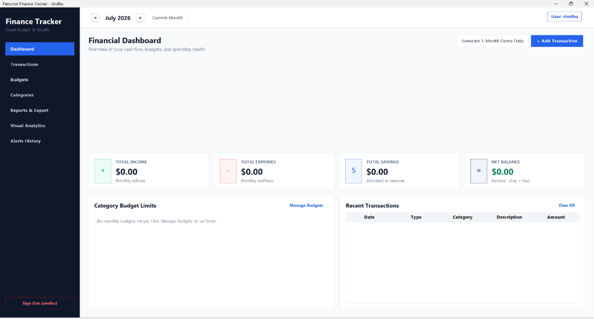
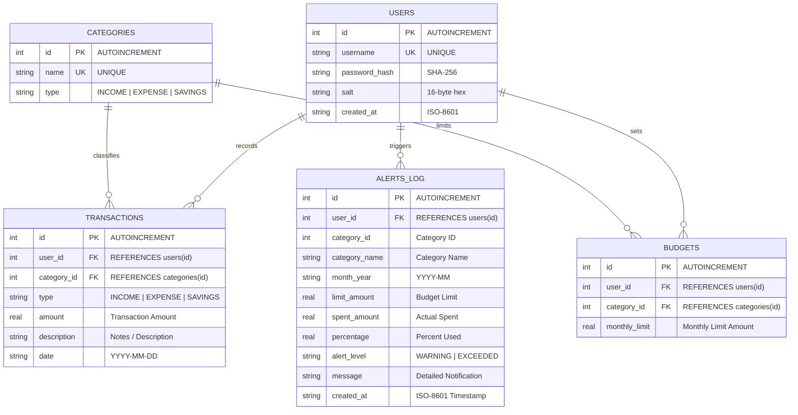
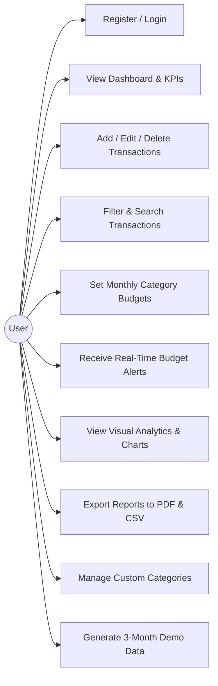

# Personal Finance Tracker 💰📊

A modern, full-featured desktop Personal Finance Tracker built with **Java 17+**, **Java Swing**, **FlatLaf**, **JDBC + SQLite**, **JFreeChart**, and **OpenPDF** in **Indian Rupees (₹)**. Designed with an **MVC + DAO (Model-View-Controller & Data Access Object)** architecture for financial planning, budgeting, audit logging, and reporting.

---

## 📸 Application Preview



---

## 🌟 Key Features

1. **Secure Authentication & Session Management**:
   - User Registration and Login with password validation.
   - Cryptographic security: **SHA-256 password hashing with unique 16-byte random salts** per user.
   - SQL Injection protection via `PreparedStatement` parameterization on all database operations.

2. **Executive Financial Dashboard**:
   - Real-time KPI summary cards: **Total Income**, **Total Expenses**, **Total Savings**, and **Net Cash Balance** in Indian Rupees (₹).
   - Category budget health progress bars with dynamic color coding (Green <80%, Amber 80%-99%, Red ≥100%).
   - Live notification banner alerting users of budget threshold breaches.
   - Quick-access Recent Transactions table and 1-click **3-Month Realistic Demo Data Generator** (Corporate Salary, Rent, Utilities, Groceries, SIPs).

3. **Transaction Management (Full CRUD)**:
   - Record, update, and delete Income, Expense, and Savings transactions.
   - Real-time filtering by **Date Range (From - To)**, **Category**, and **Transaction Type**.
   - Instant search across descriptions and category names.
   - Input validation: positive amount enforcement, date formatting, required category selection.
   - One-click **Export to CSV**.

4. **Category & Budget Management**:
   - Categorize income, expenses, and savings with default seed categories (Salary, Freelance, Food, Rent, Transport, Shopping, Entertainment, Bills, Health, Education, Savings, Investment, Emergency Fund).
   - Add, rename, and delete custom categories (with referential integrity protection against deleting categories in active use).
   - Configure monthly spending limits per category.

5. **Real-Time Budget Alerts**:
   - Immediate budget evaluation upon adding or editing expense transactions:
     - **≥ 80% (Warning)**: Warning dialog popup with remaining budget amount.
     - **≥ 100% (Exceeded)**: High-priority Alert dialog popup with overage calculation.
   - Persistent **Alerts Audit Log** table recording timestamps, category names, limits, amounts spent, and threshold percentages.

6. **Interactive Visual Analytics (JFreeChart)**:
   - **Pie Chart**: Spending distribution by Category with formatted percentages and amounts.
   - **Line Chart**: Monthly spending & savings trend lines over time.
   - **Bar Chart**: Income vs. Expense vs. Savings monthly comparison.
   - **Comparative Bar Chart**: Category Budget Limit vs. Actual Expenditure.
   - Timeframe filter (*Selected Month, Last 3 Months, Last 6 Months, Last 12 Months, All Time*).
   - Export any chart directly to high-resolution PNG image.

7. **Financial Statements & PDF / CSV Export**:
   - Executive financial summary tables and category breakdown.
   - Export to formatted **CSV**.
   - Export to professional **PDF Financial Statements** using OpenPDF with styled tables, KPIs, and metadata.

8. **Sample Demo Data Generator**:
   - Built-in generator populating 3 months of realistic corporate salaries, freelancing, rent, utilities, groceries, dining, shopping, health, investments, and category budgets for demonstrations.

---

## 🏗️ Architecture & Design Pattern

The application follows the **MVC (Model-View-Controller) + DAO (Data Access Object)** design pattern:

```
com.financetracker
 ├── model          # Entities: User, Category, Transaction, Budget, BudgetAlert, CategorySpend, MonthlySummary
 ├── dao            # Data Access Objects: UserDAO, CategoryDAO, TransactionDAO, BudgetDAO, AlertDAO
 ├── db             # Singleton DBConnection manager & DatabaseInitializer (auto-creates schema & seeds)
 ├── service        # PasswordUtil, UserService, BudgetAlertService, ReportService, SampleDataService
 ├── ui             # LoginFrame, MainFrame, DashboardPanel, TransactionPanel, BudgetPanel, CategoriesPanel,
 │                  # ReportsPanel, ChartsPanel, AlertsPanel, UITheme
 └── Main.java      # Application entry point with FlatLaf modern Look & Feel setup
```

---

## 🗄️ Database Schema & ER Diagram

The database uses SQLite (`finance_tracker.db`), auto-created and initialized on the first run with foreign key constraints enabled (`PRAGMA foreign_keys = ON;`).



---

## 📋 Use-Case Description



---

## 🚀 How to Build and Run

### Prerequisites
- **Java Development Kit (JDK 17 or higher)**
- **Maven** (or use the included `./mvnw` / `mvnw.cmd` wrapper)

### 1. Compile & Run Tests
```powershell
# Using Maven Wrapper (Windows PowerShell)
.\mvnw.cmd test

# Or using standard Maven
mvn test
```

### 2. Package into a Runnable JAR
```powershell
# Using Maven Wrapper
.\mvnw.cmd clean package

# Or using standard Maven
mvn clean package
```
This builds an executable Fat JAR via `maven-shade-plugin` at `target/personal-finance-tracker-1.0.0.jar`.

### 3. Run the Application
```powershell
java -jar target/personal-finance-tracker-1.0.0.jar
```
Or directly via Maven:
```powershell
.\mvnw.cmd compile exec:java -Dexec.mainClass="com.financetracker.Main"
```

---

## 🧪 Unit Testing Suite

The project includes unit tests covering:
- **`PasswordUtilTest`**: Verifies 16-byte random salt generation, SHA-256 hashing, and verification.
- **`UserDAOTest`**: Tests user registration, retrieval by ID/username, and duplicate username rejection.
- **`CategoryDAOTest`**: Tests category CRUD and referential integrity protection.
- **`TransactionDAOTest`**: Tests transaction CRUD, multi-criteria filtering, search, and monthly aggregations.
- **`BudgetDAOTest`**: Tests budget upsert, monthly usage calculations, and remaining budget tracking.
- **`BudgetAlertServiceTest`**: Tests threshold triggers: Normal (<80%), Warning (≥80%), and Exceeded (≥100%).
- **`ReportServiceTest`**: Verifies CSV generation and OpenPDF document compilation.

---

## 🖥️ UI Screenshots & Navigation Flow

1. **Authentication Screen**: Clean FlatLaf cards toggling between Login and Registration.
2. **Dashboard**: Top KPI cards, color-coded budget progress bars, active alert banners, and recent activity.
3. **Transactions Screen**: Rich table with badges for Income (Green), Expense (Red), and Savings (Blue), multi-filter controls, and CSV export.
4. **Budgets Screen**: Category limits overview with usage progress and status indicators (*On Track*, *Warning*, *Exceeded*).
5. **Analytics Screen**: 4 responsive JFreeCharts with period selection and PNG export.
6. **Reports Screen**: Financial statement table with date range picker, summary cards, and PDF export.
7. **Alerts History**: Audit trail of all budget threshold warnings and overages.
